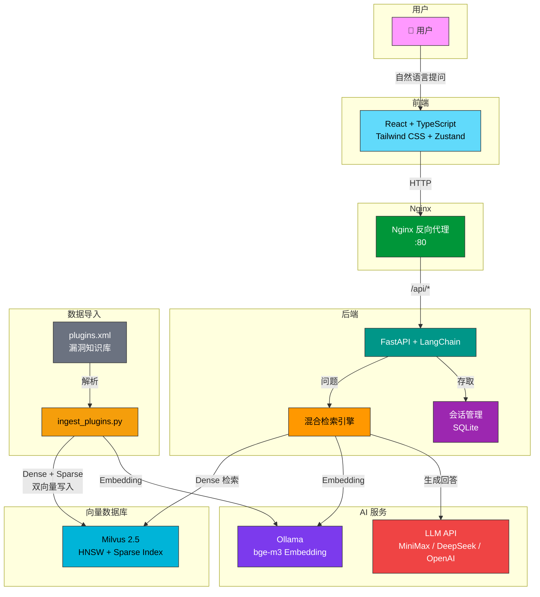

# 🛡️ 漏洞智能客服

基于 RAG（检索增强生成）+ Milvus 向量数据库的安全漏洞智能查询系统。上传漏洞知识库，即可通过自然语言查询漏洞详情、修复建议等信息。

## ✨ 功能特性

- 🔍 **智能漏洞查询** — 输入自然语言问题，自动检索匹配漏洞并生成专业回答
- 📊 **混合检索** — Dense Vector + BM25 Sparse 双路召回 + RRF 融合排序
- 💬 **多轮对话** — 支持上下文连续问答，对话历史自动持久化
- 📋 **会话管理** — 侧边栏会话列表，支持切换和删除，标题自动生成
- 📄 **多格式导入** — 支持 XML / JSON / PDF / DOCX / TXT / MD / SQLite
- 🐳 **一键部署** — Docker Compose 一键启动全栈服务

## 🏗️ 系统架构



### 查询流程

```
用户提问 → 前端 → Nginx → FastAPI
                              ↓
                    Ollama 生成 Query Embedding
                              ↓
                    Milvus Dense + BM25 Sparse 双路检索
                              ↓
                    RRF 融合排序 → Top-K 文档
                              ↓
                    LLM 基于检索结果生成回答
                              ↓
                    返回回答 + 来源 ← 前端展示
```

## 🚀 快速开始

### 前置条件

- [Docker](https://docs.docker.com/get-docker/) & Docker Compose
- [Ollama](https://ollama.ai) (本地 Embedding 服务)
- OpenAI 兼容 API Key

### 1. 克隆项目

```bash
git clone https://github.com/open0x/Milvus.git
cd Milvus
```

### 2. 配置环境变量

```bash
cp .env.example .env
```

编辑 `.env`，填入以下必要配置：

```env
OPENAI_API_KEY=your-api-key          # LLM API Key
OPENAI_API_BASE=https://api.minimaxi.com/v1  # LLM API 地址
OPENAI_MODEL=MiniMax-M2.7            # LLM 模型名
OLLAMA_BASE_URL=http://localhost:11434  # Ollama 地址
```

### 3. 启动 Ollama 并拉取 Embedding 模型

```bash
ollama pull bge-m3
```

### 4. 构建前端 & 启动服务

```bash
cd frontend && npm install && npm run build && cd ..
docker-compose up -d
```

访问 http://localhost 即可使用。

### 5. 导入漏洞数据

```bash
# 在后端容器内执行
docker cp data/plugins.xml rag-backend:/app/plugins.xml
docker cp backend/scripts/ingest_plugins.py rag-backend:/app/ingest_plugins.py
docker exec rag-backend .venv/bin/python /app/ingest_plugins.py \
  --path /app/plugins.xml --collection vuln_kb --batch-size 50
```

## 📁 项目结构

```
Milvus/
├── backend/
│   ├── src/
│   │   ├── api/routers/        # FastAPI 路由 (chat, ingest)
│   │   ├── core/               # 配置、Embedding、向量库、日志
│   │   ├── services/           # 搜索服务、对话服务、会话存储
│   │   └── models/             # Pydantic 数据模型
│   └── scripts/                # 数据导入脚本
├── frontend/
│   └── src/
│       ├── api/                # API 调用封装
│       ├── components/         # React 组件
│       └── stores/             # Zustand 状态管理
├── nginx/                      # Nginx 反向代理配置
├── data/                       # 数据文件目录
└── docker-compose.yml
```

## 💻 本地开发

### 后端

```bash
cd backend
uv sync
uv run uvicorn src.api.main:app --reload --port 8000
```

### 前端

```bash
cd frontend
npm install
npm run dev
```

## 📥 知识库导入

### 漏洞数据（plugins.xml）

```bash
# 使用专用脚本导入，支持 dense + sparse 双向量
python scripts/ingest_plugins.py --path data/plugins.xml --collection vuln_kb

# 限制导入数量（测试用）
python scripts/ingest_plugins.py --path data/plugins.xml --limit 200
```

### 通用文档导入

```bash
# 支持格式：pdf, docx, txt, md, xml, json, sqlite
python scripts/ingest_data.py --path ./data/docs --collection my_kb

# 自定义分块参数
python scripts/ingest_data.py --path ./data/docs --collection my_kb \
  --chunk-size 512 --chunk-overlap 100
```

### 漏洞 XML 格式

```xml
<?xml version="1.0" encoding="utf-8"?>
<RECORDS>
    <RECORD>
        <pluginid>ce35d2823e338cf9988b396540721312</pluginid>
        <pluginname>某产品 SQL注入漏洞</pluginname>
        <productname>product_name</productname>
        <holetype>injection</holetype>
        <level>3</level>
        <cvss3>8.6</cvss3>
        <description>漏洞描述</description>
        <recommendation>修复建议</recommendation>
    </RECORD>
</RECORDS>
```

## ⚙️ 环境变量

| 变量 | 说明 | 默认值 |
|------|------|--------|
| `OPENAI_API_KEY` | LLM API 密钥 | - |
| `OPENAI_API_BASE` | LLM API 地址 | https://api.minimaxi.com/v1 |
| `OPENAI_MODEL` | LLM 模型名 | MiniMax-M2.7 |
| `OLLAMA_BASE_URL` | Ollama 服务地址 | http://localhost:11434 |
| `OLLAMA_EMBEDDING_MODEL` | Embedding 模型 | bge-m3 |
| `EMBEDDING_DIM` | 向量维度 | 1024 |
| `MILVUS_URI` | Milvus 连接地址 | http://milvus:19530 |
| `DEFAULT_COLLECTION` | 默认 Collection | vuln_kb |
| `TOP_K` | 检索返回数量 | 5 |

## 📄 License

MIT
