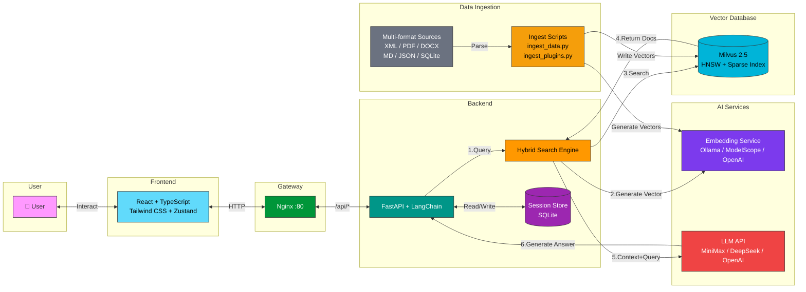

# 🛡️ Vulnerability Intelligent Assistant

A security vulnerability intelligent query system built on RAG (Retrieval-Augmented Generation) + Milvus vector database. Upload your vulnerability knowledge base and query vulnerability details, remediation advice, and more through natural language.

[中文文档](README.md)

## ✨ Features

- 🔍 **Intelligent Vulnerability Query** — Ask questions in natural language, automatically retrieve matching vulnerabilities and generate professional answers
- 📊 **Hybrid Search** — Dense Vector + BM25 Sparse dual retrieval + RRF fusion ranking
- 💬 **Multi-turn Conversation** — Context-aware Q&A with automatic chat history persistence
- 📋 **Session Management** — Sidebar session list with switching, deletion, and auto-generated titles
- 📄 **Multi-format Import** — Supports XML / JSON / PDF / DOCX / TXT / MD / SQLite
- 🐳 **One-click Deployment** — Full-stack service with Docker Compose

## 🏗️ System Architecture



### Query Flow

```
User Query → Frontend → Nginx → FastAPI
                                  ↓
                        Embedding Service generates Query Vector
                                  ↓
                        Milvus Dense + BM25 Sparse Dual Retrieval
                                  ↓
                        RRF Fusion Ranking → Top-K Documents
                                  ↓
                        LLM generates answer based on retrieved context
                                  ↓
                        Return Answer + Sources ← Frontend Display
```

## 🚀 Quick Start

### Prerequisites

- [Docker](https://docs.docker.com/get-docker/) & Docker Compose
- Embedding service (choose one):
  - [Ollama](https://ollama.ai) (local deployment, recommended)
  - ModelScope / OpenAI-compatible API (cloud-based)
- LLM API Key (MiniMax / DeepSeek / OpenAI, etc.)

### 1. Clone the Repository

```bash
git clone https://github.com/open0x/Milvus.git
cd Milvus
```

### 2. Configure Environment Variables

```bash
cp .env.example .env
```

Edit `.env` with the required configuration:

```env
OPENAI_API_KEY=your-api-key          # LLM API Key
OPENAI_API_BASE=https://api.minimaxi.com/v1  # LLM API endpoint
OPENAI_MODEL=MiniMax-M2.7            # LLM model name

# Embedding Configuration (choose one)
# Option 1: Ollama local deployment (recommended)
OLLAMA_BASE_URL=http://localhost:11434
OLLAMA_EMBEDDING_MODEL=bge-m3

# Option 2: ModelScope cloud API
# EMBEDDING_API_BASE=https://api-inference.modelscope.cn/v1
# MODELSCOPE_API_KEY=your-modelscope-api-key
# EMBEDDING_MODEL=Qwen/Qwen3-Embedding-0.6B

# Option 3: OpenAI-compatible API
# EMBEDDING_API_BASE=https://api.openai.com/v1
# OPENAI_API_KEY=your-api-key
# EMBEDDING_MODEL=text-embedding-3-small
```

### 3. Start Embedding Service

**Option 1: Ollama local deployment (recommended)**

```bash
ollama pull bge-m3
```

**Option 2: Cloud API**

No local deployment needed — just configure the API Key and endpoint in `.env`.

### 4. Build Frontend & Start Services

```bash
cd frontend && npm install && npm run build && cd ..
docker-compose up -d
```

Visit http://localhost to use the application.

### 5. Import Knowledge Base Data

```bash
# Run inside the backend container

# Import vulnerability XML data (dedicated script, supports dense + sparse dual vectors)
docker cp data/plugins.xml rag-backend:/app/plugins.xml
docker cp backend/scripts/ingest_plugins.py rag-backend:/app/ingest_plugins.py
docker exec rag-backend .venv/bin/python /app/ingest_plugins.py \
  --path /app/plugins.xml --collection vuln_kb --batch-size 50

# Or use the general import script (supports multiple formats)
docker cp backend/scripts/ingest_data.py rag-backend:/app/ingest_data.py
docker exec rag-backend .venv/bin/python /app/ingest_data.py \
  --path /app/data/docs --collection my_kb
```

## 📁 Project Structure

```
Milvus/
├── backend/
│   ├── src/
│   │   ├── api/routers/        # FastAPI routes (chat, ingest)
│   │   ├── core/               # Config, Embedding, Vector Store, Logging
│   │   ├── services/           # Search, Chat, Session Store
│   │   └── models/             # Pydantic data models
│   └── scripts/                # Data ingestion scripts
├── frontend/
│   └── src/
│       ├── api/                # API client wrappers
│       ├── components/         # React components
│       └── stores/             # Zustand state management
├── nginx/                      # Nginx reverse proxy config
├── data/                       # Data files directory
└── docker-compose.yml
```

## 💻 Local Development

### Backend

```bash
cd backend
uv sync
uv run uvicorn src.api.main:app --reload --port 8000
```

### Frontend

```bash
cd frontend
npm install
npm run dev
```

## 📥 Knowledge Base Import

### Supported Data Formats

| Format | Extension | Description |
|--------|-----------|-------------|
| Vulnerability XML | .xml | Vulnerability plugin format (auto-detected by pluginid field) |
| FAQ XML | .xml | Q&A pair format |
| PDF | .pdf | Auto-extracted text |
| Word | .docx | Auto-extracted text |
| Text | .txt | Plain text files |
| Markdown | .md | Auto-split by paragraphs |
| JSON | .json | Structured data |
| SQLite | .db, .sqlite, .sqlite3 | Database table data |

### Vulnerability Data Import (Dedicated Script)

```bash
# Import with dedicated script, supports dense + sparse dual vectors
python scripts/ingest_plugins.py --path data/plugins.xml --collection vuln_kb

# Limit import count (for testing)
python scripts/ingest_plugins.py --path data/plugins.xml --limit 200

# Custom batch size
python scripts/ingest_plugins.py --path data/plugins.xml --collection vuln_kb --batch-size 50
```

### General Document Import

```bash
# Import a single file (auto-detect format)
python scripts/ingest_data.py --path ./data/docs/report.pdf --collection my_kb

# Import an entire directory (batch processing)
python scripts/ingest_data.py --path ./data/docs --collection my_kb

# Custom chunking parameters
python scripts/ingest_data.py --path ./data/docs --collection my_kb \
  --chunk-size 512 --chunk-overlap 100

# Import a specific SQLite table
python scripts/ingest_data.py --path ./data/app.db --collection users --table users
```

### Vulnerability XML Format

```xml
<?xml version="1.0" encoding="utf-8"?>
<RECORDS>
    <RECORD>
        <pluginid>ce35d2823e338cf9988b396540721312</pluginid>
        <pluginname>Product SQL Injection Vulnerability</pluginname>
        <productname>product_name</productname>
        <holetype>injection</holetype>
        <level>3</level>
        <cvss3>8.6</cvss3>
        <description>Vulnerability description</description>
        <recommendation>Remediation advice</recommendation>
    </RECORD>
</RECORDS>
```

## ⚙️ Environment Variables

| Variable | Description | Default |
|----------|-------------|---------|
| `OPENAI_API_KEY` | LLM API key | - |
| `OPENAI_API_BASE` | LLM API endpoint | https://api.minimaxi.com/v1 |
| `OPENAI_MODEL` | LLM model name | MiniMax-M2.7 |
| `OLLAMA_BASE_URL` | Ollama service URL | http://localhost:11434 |
| `OLLAMA_EMBEDDING_MODEL` | Ollama embedding model | bge-m3 |
| `EMBEDDING_API_BASE` | Cloud embedding API endpoint | - |
| `EMBEDDING_MODEL` | Cloud embedding model name | - |
| `EMBEDDING_DIM` | Vector dimension | 1024 |
| `MILVUS_URI` | Milvus connection URI | http://milvus:19530 |
| `DEFAULT_COLLECTION` | Default collection name | vuln_kb |
| `TOP_K` | Number of results to retrieve | 5 |

## 📄 License

MIT
